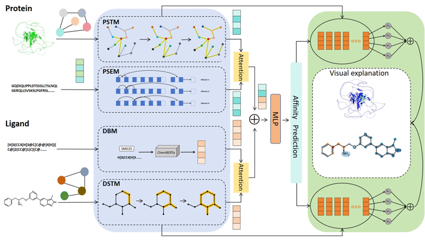
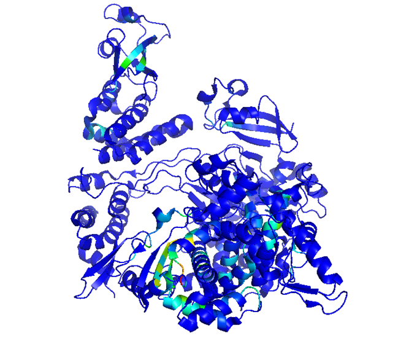
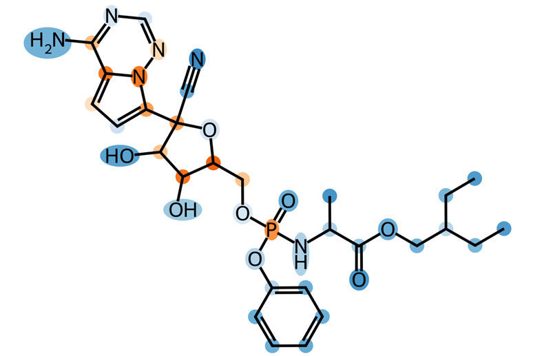

# M2DTSP: Multi-modal Feature Fusion for Drug-Target Binding Site Prediction in Drug Design

## Core Features

### Multi-modal Feature Fusion
- **Integrates**:
  - Protein dynamics (ANM model)
  - Structural features (GNN)
  - Sequence features (dilated CNN)
- **Combines**:
  - Drug molecular graphs (GNN)
  - SMILES sequences (ChemBERTa)

### Two-stage Prediction
- **Binding Affinity**: 
  - Deep fully-connected network outputs Kd values.
- **Binding Sites**: 
  - Atom-level heatmaps via Grad-WAM visualization.

## Technical Highlights
- **Multi-scale Extraction**: 
  - Dilated CNN + GNN captures local and global features.
- **Attention Mechanism**: 
  - Dynamic weighting of key biological features.
- **Grad-WAM**: 
  - Gradient-weighted activation mapping for binding site localization.

## Web Platform
Access the interactive prediction platform: [http://47.104.134.46:2000/ppipredict](http://47.104.134.46:2000/ppipredict)

### Key Features:
- **PDB/SMILES Upload Interface**
- **3D Binding Site Visualization** (NGL-powered)
- **Affinity Value Reporting**

### Validation Case
- **SARS-CoV-2 RdRp + Remdesivir Results**
  
  
